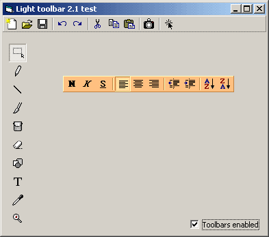



## ucToolbar 2\.1

### Description

Lightweight toolbar. Now, three button types supported: Normal, Check and Option. // 20Kb zip.
 
### More Info
 

             |
---                |---
**Submitted On**   |2003-11-03 08:39:06
**By**             |[Carles P\.V\.](https://github.com/Planet-Source-Code/PSCIndex/blob/master/ByAuthor/carles-p-v.md)
**Level**          |Intermediate
**User Rating**    |5.0 (99 globes from 20 users)
**Compatibility**  |VB 6\.0
**Category**       |[Custom Controls/ Forms/  Menus](https://github.com/Planet-Source-Code/PSCIndex/blob/master/ByCategory/custom-controls-forms-menus__1-4.md)
**World**          |[Visual Basic](https://github.com/Planet-Source-Code/PSCIndex/blob/master/ByWorld/visual-basic.md)
**Archive File**   |[Light\_tool1666711132003\.zip](https://github.com/Planet-Source-Code/carles-p-v-uctoolbar-2-1__1-49179/archive/master.zip)

